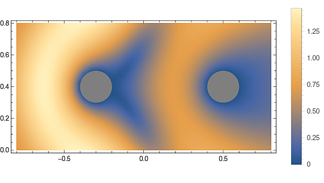
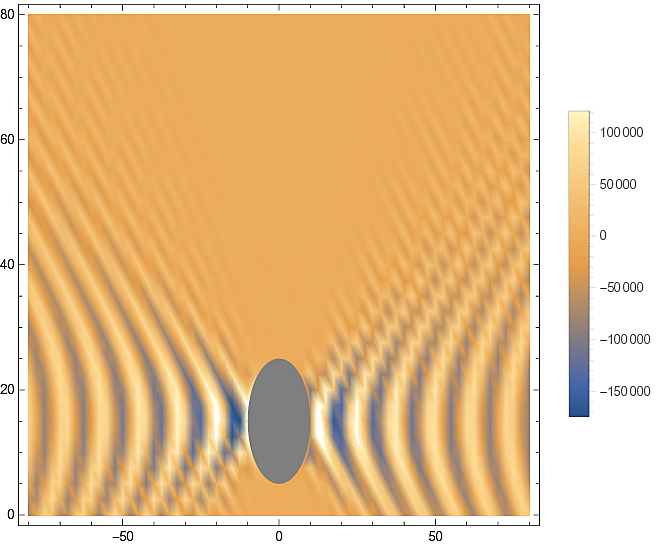
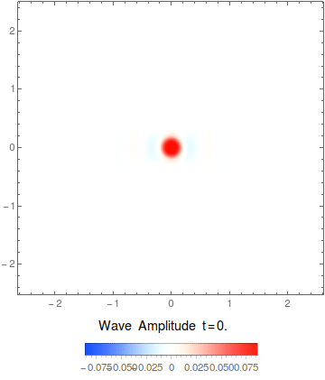
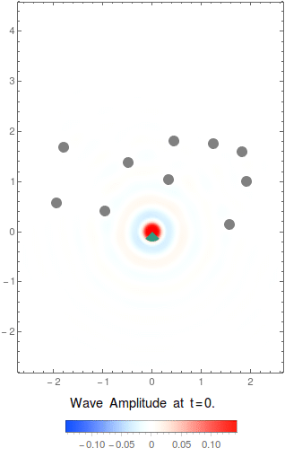
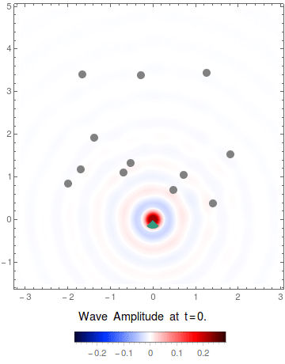

## MultipleScattering2D.wl - exact multiple scattering in 2D for Mathematica

A package to calculate multiple scattering according to the 2D wave equation. The best place to get started is the notebook [TwoBodyScattering.nb](examples/TwoBodyScattering.nb). The example [ImpulseWave.nb](examples/ImpulseWave.nb) uses randomly place scatterers, similar to the gifs below, whereas [Source.nb](examples/Source.nb) shows how to change source function. 

At present all scatterers need to be cylinders of the same size, but can be placed anywhere. The incident wave can be anything, but the default for the package is the 2D green's function. There are functions to calculate the total wave in frequency and time, together with examples on how to plot them. For details on the maths see [Martin (1995)](https://pdfs.semanticscholar.org/8bd3/38ec62affc5c89592a9d6d13f1ee6a7d7e53.pdf).

## Examples 

Scattering of a plane wave from two cylinders for one frequency generated by [TwoBodyScattering.nb](examples/TwoBodyScattering.nb)

Diffraction of a point source (2D Green's function), from one big cylinder for one frequency generated by [BigCylinderDiffraction.nb](examples/BigCylinderDiffraction.nb)

By lining up cylinders above and below the source, we effectively create two walls:

### The package's focus is on scattering from randomly placed cyclinders, for example see the notebook  [ImpulseWave.nb](examples/ImpulseWave.nb)
#### Dirichlet boundary conditions

#### Neumann boundary conditions

